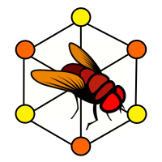

===========
EOScircuits
===========

Drosophila Early Olfactory Circuit Libraries for FlyBrainLab.

* Documentation: https://flybrainlab.github.io/EOSCircuits/

Features
========

1. Integration with `OlfTrans`_ for modeling odorant input
2. Simulation of *Drosophila* Antenna circuit based on model in `Lazar, A. A., & Yeh, C.-H. (2020).`_
3. Simulation of *Drosophila* Antennal Lobe and Mushroom Body based on modified model in `Lazar, A. A., Liu, T., & Yeh, C. H. (2020).`_

API
===

See :code:`notebooks` folder for detailed examples of using each circuit module.

There are 3 modules that are exposed to user, each 1 of the modules has 2 main classes: :code:`Config` and :code:`Circuit`.
The :code:`Config` completely specifies the executable circuit that is the core concept of :code:`Circuit`. To do this,
each instance of :code:`Config` specifies the number as well as the unique ids of each individual nodes in the circuit.
For example, in :code:`eoscircuits.ant.ANTConfig`, the number of nodes and other relevant attributes are specified as

1. :code:`eoscircuits.ant.ANTConfig.NR`: Number of receptors in the graph
2. :code:`eoscircuits.ant.ANTConfig.NO`: Number of Olfactory Sensory Neurons (OSNs) expressing each given receptor type
3. :code:`eoscircuits.ant.ANTConfig.affs`: An array of affinity values (of length :code:`eoscircuits.ant.ANTConfig.NR`) for each receptor type. The concept of affinity is detailed in the paper `Lazar, A. A., & Yeh, C.-H. (2020).`_ as well as in the package `OlfTrans`_.
3. :code:`eoscircuits.ant.ANTConfig.receptors`: An array of names (of length :code:`eoscircuits.ant.ANTConfig.NR`) for each receptor type

Based on these, the node ids for the Odorant Transduction Process (OTP) nodes, as well as the Biophysical Spike Generators (BSG) nodes in
the Antenna circuit is given as:

1. :code:`eoscircuits.ant.ANTConfig.osn_otps`: the naming scheme follows the format :code:`'OSN/{receptor_name}/{osn_index}/OTP'`, where the :code:`osn_index` specifies the index of the OSN expressing this specific :code:`receptor_name`. The value for :code:`osn_index` is from :code:`0` to :code:`eoscircuits.ant.ANTConfig.NO[r]-1` where :code:`r` is the index of the specific :code:`receptor_name` within the :code::code:`eoscircuits.ant.ANTConfig.receptors` array.
2. :code:`eoscircuits.ant.ANTConfig.osn_bsgs`: the naming scheme follows the format :code:`'OSN/{receptor_name}/{osn_index}/BSG'`

After the :code:`Config` object is instantiated, the main entry point for each :code:`Circuit` is the *classmethod* :code:`Circuit.create_from_config`,
which will create a `networkx.MultiDiGraph`_ (as attribute :code:`Circuit.graph`) that is compatible with our simulation engine of choice: `NeuroKernel`_ using `NeuroDriver`_ as circuit specification API.

Each instance of :code:`Circuit` can be simulated by calling the :code:`Circuit.simulate` function. However, you need to specify
the inputs to pass to the circuit as well as the outputs that you would like to record. The inputs are specified as instances
of :code:`neurokernel.LPU.InputProcessors` and the outputs (specified as the :code:`record_var_list` argument to :code:`Circuit.simulate`)
is a list of tuple of the form :code:`(variable_name, node_ids)`. The simulation will return a tuple of 3 elements that correspond to
the `InputProcessor`_, `OutputProcessor`_ and the `LPU`_ that, together, completely specifies an executable circuit for `NeuroDriver`_.

Circuit Modules
---------------
Using the API specified above, *EOSCircuits* provides the following 3 modules to model the *Drosophila* olfactory system:

1. :code:`eoscircuits.ant`: Antenna Circuit

   * :code:`eoscircuits.ant.ANTConfig`
   * :code:`eoscircuits.ant.ANTCircuit`

2. :code:`eoscircuits.al`: Antennal Lobe Circuit

   * :code:`eoscircuits.ant.ALConfig`, subclassed from :code:`eoscircuits.ant.ANTConfig`
   * :code:`eoscircuits.ant.ALCircuit`

3. :code:`eoscircuits.mb`: Mushroom Body Circuit

   * :code:`eoscircuits.ant.MBConfig` subclassed from :code:`eoscircuits.ant.ALConfig`
   * :code:`eoscircuits.ant.MBCircuit`

References
==========

1. `Lazar, A. A., & Yeh, C.-H. (2020).`_ *A molecular odorant transduction model and the complexity of spatio-temporal encoding in the Drosophila antenna*. PLOS Computational Biology.
2. `Lazar, A. A., Liu, T., & Yeh, C. H. (2020).`_ *An odorant encoding machine for sampling, reconstruction and robust representation of odorant identity*. ICASSP.
3. `Lazar, A. A., Liu, T., Turkcan, M. K., & Zhou, Y. (2021).`_ *Accelerating with FlyBrainLab the discovery of the functional logic of the Drosophila brain in the connectomic era*. ELife.

License
=======
Free software: BSD license

Credits
=======

This package was created with Cookiecutter_ and the `audreyr/cookiecutter-pypackage`_ project template.

.. _Cookiecutter: https://github.com/audreyr/cookiecutter
.. _`audreyr/cookiecutter-pypackage`: https://github.com/audreyr/cookiecutter-pypackage
.. _`Lazar, A. A., & Yeh, C.-H. (2020).`: https://doi.org/10.1371/journal.pcbi.1007751
.. _`Lazar, A. A., Liu, T., & Yeh, C. H. (2020).`: https://doi.org/10.1109/ICASSP40776.2020.9054588
.. _`Lazar, A. A., Liu, T., Turkcan, M. K., & Zhou, Y. (2021).`: https://doi.org/10.7554/eLife.62362
.. _`OlfTrans`: https://github.com/FlyBrainLab/OlfTrans
.. _`networkx.MultiDiGraph`: https://networkx.org/documentation/stable/reference/classes/multidigraph.html?highlight=multidigraph#networkx.MultiDiGraph
.. _`NeuroKernel`: https://github.com/neurokernel/neurokernel
.. _`NeuroDriver`: https://github.com/neurokernel/neurodriver
.. _`InputProcessor`: https://github.com/neurokernel/neurodriver/tree/master/neurokernel/LPU/InputProcessors
.. _`OutputProcessor`: https://github.com/neurokernel/neurodriver
.. _`LPU`: https://github.com/neurokernel/neurodriver/blob/master/neurokernel/LPU/LPU.py
